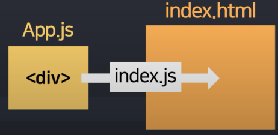

# REACT

## 05/27(금)

### - 리액트 1강 : 리액트 설치법과 명령어

- npx create-react-app blog
  - npx : 라이브러리 설치 도와주는 명령어(nodejs 설치 되어있어야 이용 가능)
  - create-react-app : 리액트 셋팅 다 된 boilerplate 만들기 쉽게 도와주는 라이브러리
  - blog : 프로젝트명
- npm start
  - 페이지 열 수 있음
- node.js를 왜 설치했냐면
  - npm이라는 툴을 이용가능
  - create-react-app 라이브러리를 사용하기 위해
- 프로젝트 설치 후 깔려 있는 폴더 설명
  - node_modules : 라이브러리 코드 보관함
  - public : static 파일 모아놓는 곳
  - src : 코드짜는 곳
    - App.js가 메인페이지
    - App.js에서 작성한 코드르 index.js를 통해 index.html이라는 메인페이지에서 보여줄 수 있다.
      - js에서 짠 코드를 통해 html로 나타낼 수 있음

## 05/29(일)

### - 리액트 2강 : JSX 문법은 3개가 다임

- jsx를 사용하는 이유
  - 더 쉽게 태그를 사용하고 코드를 짜기 위해
- JSX 문법 1
  - class가 아니라 `className` 이라고 사용해야 함
- JSX 문법 2
  - 변수 넣을 때 `{ 변수이름 }`

- JSX문법 3
  - style 넣을 때 `style = {}`
  - style 넣을 때 `style = { { 스타일명 : '값' } }`

## 05/30(월)

### - 리액트 3강 : state 쓰면 뭐가 좋냐면

- return() 안에는 병렬로 태그 2개 이상 기입금지
- state 만드는 법
  1. import { useState } from 'react';
  2. useState(보관할 자료)
  3. let [a, b]
     - a : state에 보관했던 자료 나옴
     - b : state 변경 도와주는 함수
- 변수 문법이 있는데 왜 state를 써야할까?
  - 일반 변수는 갑자기 변경되면 html에 자동으로 반영안됨
  - state는 갑자기 변경되면 state 사용하던 html은 자동으로 재렌더링됨 
    - 변동시 자동으로 html에 반영되게 만들고 싶으면 state를 사용
- 정리!
  - 자주 변경될 거 같은 html 부분은 state로 만들어놓기
- 숙제
  - 글을 만들어오기 (state로!)

## 06/01(수)

### - 리액트 4강 : 버튼에 지리는 기능 만들기

- ERROR는 중요
- WARNING(WARNING, 노란색)은 무시가능
  - `eslint-disable` 맨 위에 넣어주면 warning 메시지 안 뜨게 할 수 있음
- `state`로 페이지 안에서 자주 바뀌는 것들을 만들어 두기

- `onClick` 하는 법
  - onClick={} 안에 함수 이름을 넣어야함
  - 혹은 () => { 실행할 자바스크립트 코드 } 이런 식으로 넣어도 됨
- state는 등호로 변경 금지
- state 변경하는 법
  - state변경함수 (새로운 state)

## 06/02(목)

### - 리액트 5강 : state가 array/object면

- array/object 다룰 때 원본은 보존하는 게 좋음
  - 원본을 영구적으로 수정할 경우 다시 필요하다면 사용할 수 없음
  - 따라서 카피본을 하나 만듦
- [state 변경함수 특징]
  - 기존 state == 신규 state의 경우 변경안해줌(등호로 비교해서 같을 경우)
- [array/object 특징]
  - array/object 담은 변수엔 화살표만 저장됨
- 변수1 & 변수2 화살표가 같으면 변수1 == 변수2 비교해도 true 나옴
  - 따라서 [...배열이름]을 사용한다.
    - '...' 은 괄호를 벗겨 주세요 라는 의미

- state가 array/object면 독립적 카피본을 만들어서 수저앻야 함
  - shallow copy를 만들어야함

## 06/03(금)

### - 리액트 6강 : div 너무 많으면 Component

- `<Modal/>`  <- 컴포넌트

- 컴포넌트 만드는 법

  1. function 만들고 (다른 function 밖에서 만들어야함)
     - 다른 function 밖에서 만들어야함(function App밖에서)
     - 함수명 첫번째는 대문자로(영어)

  2. return () 안에 html 담기

  3. <함수명></함수명> 쓰기

- 어떤걸 컴포넌트로 만들면 좋은가?
  1. 반복적인 html 축약할 때
  2. 큰 페이지들
  3. 자주 변경되는 것들

- 컴포넌트의 단점
  - state 가져다쓸 때 문제생김

##### * 참고사항

- return() 안에 html 병렬기입하려면
  - 의미없는 `
`대신 `<> </>`사용가능
- `<함수명></함수명>`, `<함수명/>` 둘 다 가능