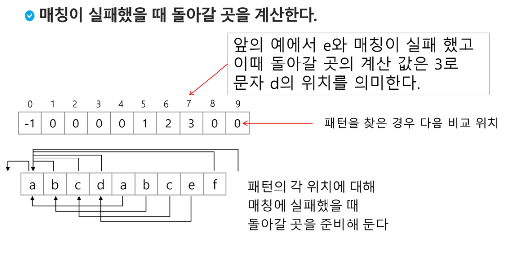

# 3. 문자열(string)


- #### 문자열

- #### 패턴 매칭

- #### 문자열 암호화

- #### 문자열 압축


---


- #### 컴퓨터에서의 문자표현

  - 알파벳 A를 메모리에 저장하는 방법
  - 영어가 대소문자 합쳐서 52이므로 6(64가지)비트면 모두 표현할 수 있다. 이를 코드체계라고 한다.
    - 000000 => 'a',000001 => 'b'

- 그런데 네트워크가 발전하면서 서로간에 정보를 주고 받을 때 정보를 달리 해석하는 문제가 생겼다.


- 그래서 혼동을 피하기 위해 1976년 미국에서 ASCII(American Standard Code for Information Interchange)라는 문자 인코딩 표준이 제정되었다.
  - 7bit 인코등으로 128문자를 표현하며 33개의 출력불가능한 제어 문자들과 공백을 비롯한 95개의 출력 가능한 문자들로 이루어져 있다.

- 출력 가능 아스키 문자 (32 ~ 126)


---


- 확장 아스키는 표준 문자 이외의 악센트 문자, 도형 문자, 특수 문자, 특수 기호 등 부가적인 문자를 128개 추가할 수 있게 하는 부호이다.
  - 확장 아스키는 프로그램이나 컴퓨터 또는 프린터가 그것을 해독할 수 있도록 설계되어 있어야만 올바로 해독될 수 있다.


---


- 다른 나라에서도 컴퓨터가 발전했으며 각 국가들은 자국의 문자를 표현하기 위하여 코드체계를 만들어서 사용했다.
  - 하지만 자국의 코드체계를 타 국가가 가지고 있지 않으면 정보를 잘 못 해석 할 수 있었고
  - 그래서 표준을 마련하였는데, 이를 <strong>유니코드</strong>라고 한다.


- 유니코드도 다시 Character Set으로 분류된다.
  - UCS-2 / UCS-4
  - 하지만 파일을 인식 시 UCS-2, UCS-4인지 인식하고 각 경우를 구분해서 모두 다르게 구현해야 하는 문제 발생


- 유니코드 인코딩(UTF : Unicode Transformation Format)

  -  UTF-8 (in web)
    - MIN : 8bit / MAX : 32bit (1 Byte * 4)
  - UTF-16 (in windows, java)
    - MIN : 16bit / MAX : 32bit (2 Byte * 2)

  - UTF-32 (in unix)
    - MIN : 32bit / MAX : 32bit (4 Byte * 1)


- Python 인코딩
  - 2.x 버전 : ASCII => `#-*-coding : utf-8 -*-` (첫줄에 명시)
  - 3.x 버전 : 유니코드 UTF-8 => `생략 가능`
  - 다른 인코딩 방식으로 처리 시 첫 줄에 작성하는 위 항목에 원하는 인코딩 방식을 지정해주면 됨


---


- ## 문자열의 분류


- java에서 String 클래스에 대한 메모리 배치 예


- C언어에서 문자열 처리


---


- [참고]

- 다음 두 코드의 차이 이해하기

  - s1 = list(input( ))
  - s2 = input( )

- strlen( ) 함수 만들어 보기

  - def strlen(a) : #'\0'을 만나면 '\0'을 제외한 글자수를 리턴

    - #while을 써서 함수를 완성해보세요

    - a = ['a', 'b', 'c', '\0']

    - print(strlen(a))

      

```python
def mystrlen(s):
    i = 0
    while s[i]!='\0':
        i += 1
   	return i

a = ['a', 'b', 'c', '\0']
print(mystrlen(a))   # => 3
```


---


- Java(객체지향 언어)에서의 문자열 처리


---


- Python에서의 문자열 처리
  - char 타입 없음
  - 텍스트 데이터의 취급방법이 통일되어 있음


- 문자열 기호
  - -'(홑따옴표), "(쌍따옴표), '"(홑따옴표 3개), """(쌍따옴표 3개)
  - +연결(Concatenation)
    - 문자열 + 문자열 : 이어 붙여주는 역할
  - *반복
    - 문자열 * 수 : 수만큼 문자열이 반복


- Python에서의 문자열 처리
  - 문자열은 요소값을 변경 할 수 없으며(immutable) 시퀀스 자료형으로 분류되고, 인덱싱과 슬라이싱 연산들을 사용할 수 있음
  - replace( ), split( ), isalpha( ), find( ) 사용 가능


- C와 Java의 String 처리의 기본적인 차이점
  - C는 아스키 코드로 저장한다.
  - Java는 유니코드(UTF16, 2byte)로 저장한다.
  - 파이썬은 유니코드(UTF8)로 저장한다.


---


- ##### 연습문제 : 문자열 뒤집기

  - 자기 문자열에서 뒤집는 방법이 있고 새로운 빈 문자열 을 만들어 소스의 뒤에서부터 읽어서 타겟에 쓰는 방법이 있겠다.
  - 자기 문자열을 이용할 경우는 swap을 위한 임시 변수가 필요하며 반복 수행을 문자열 길이의 반만을 수행해야 한다.


- Python은 reverse 함수 혹은 slice notation을 이용하여 구현하면 된다.


---


- C strcmp( ) 함수를 제공한다.
- Java에서는 equals( ) 메소드를 제공한다.
  - 문자열 비교에서 == 연산은 메모리 참조가 같은지를 묻는 것
- 파이썬에서는 == 연산자와 is 연산자를 제공한다.
  - == 연산자는 내부적으로 특수 메서드 `_eq_( )`를 호출
  - [ 참고 ] s1과 나머지 문자열을  ==, is로 비교한 결과를 확인해보세요
    - s1 = 'abc'
    - s2 = 'abc'
    - s3 = 'def'
    - s4 = s1
    - s5 = s1[:2] + 'c'

```
```


- 다음 C 코드를 참고해 문자열 비교함수를 만들어보자


```python
a = 'ab'
b = 'abc'
c = 'de'
d = 'Abc'

print(a<b) # => True
print(a>b) # => False
print(a<c) # => True
print(a>c) # => False
print(a<d) # => False
```


- C 언어에서는 atoi( )함수를 제공한다. 역 함수로는 itoa( )가 있다.
- java에서는 숫자 클래스의 parse 메소드를 제공한다.
  - 역함수로는 toString( )메소드를 제공한다.
- 파이썬에서는 숫자와 문자변환 함수를 제공한다.
  - ex) int('123'), float("3.14"), str(123), repr(123)


- int( )와 같은 atoi( ) 함수 만들기
  - s = '123'
  - a = atoi(s)
  - print(a + 1)

```python
def atoi(s):
    i = 0
    for x in s:
        i = i*10 + ord(x) - ord('0')
    return i
```


---


- ##### 연습문제2 : str( ) 함수를 사용하지 않고, itoa( )를 구현해 봅시다.

  - 양의 정수를 입력 받아 문자열로 변환하는 함수
  - 입력 값 : 변환할 정수 값, 변환된 문자열을 저장할 문자배열
  - 반환 값 : 없음
    - [참고] ord( ), chr( )
  - 음수를 변환할 때는 어떤 고려 사항이 필요한가?


---


- ## 패턴 매칭


- #### 패턴 매칭에 사용되는 알고리즘들

  - 고지식한 패턴 검색 알고리즘
  - 카프-라빈 알고리즘
  - KMP 알고리즘
  - 보이어-무어 알고리즘


---


- ### 고지식한 알고리즘(Brute Force)

  - 본문 문자열을 처음부터 끝까지 차례대로 순회하면서 패턴 내의 문자들을 일일이 비교하는 방식으로 동작


```python
p = 'is' # 찾을 패턴
t = 'This is a book~!' # 전체 텍스트
M = len(p) # 찾을 패턴의 길이
N = len(t) # 전체 텍스트의 길이

def BruteForce(p, t):
    i = 0 # t의 인덱스
    j = 0 # p의 인덱스
    while j < M and i < N:
        if t[i] != p[j]:
            i = i - j
            j = -1
       	i = i + 1
        j = j + 1
    if j == M: return i - M # 검색 성공
    else: return -1 # 검색 실패
```

- 고지식한 패턴 검색 알고리즘의 시간 복잡도
  - 최악의 경우 텍스트의 모든 위치에서 패턴을 비교해야 하므로 O(MN)이 됨


---


- ### KMP 알고리즘

  - 불일치가 발생한 텍스트 스트링의 앞 부분에 어떤 문자가 있는지를 미리 알고 있으므로, 불일치가 발생한 앞 부분에 대하여 다시 비교하지 않고 매칭을 수행
  -  시간 복잡도 : O( M + N )

- 아이디어 설명

  - 텍스트에서 abcdabc까지는 매치되고, e에서 실패한 상황 패턴의 맨 앞의 abc와 실패 직전의 abc는 동일함을 이용할 수 있다.
  - 실패한 텍스트 문자와 P[4]를 비교한다.




```python
# 많은 구현 방법이 있지만 그 중 한 예시

def kmp(t, p):
    N = len(t)
    M = len(p)
    lps = [0] * (M + 1)

    # preprocessing
    j = 0   # 일치한 개수 == 비교할 패턴 위치
    lps[0] = -1
    for i in range(1, M):
        lps[i] = j          # p[i] 이전에 일치한 개수
        if p[i] == p[j]:
            j += 1
        else:
            j = 0
    lps[M] = j

    # search
    i = 0   # 비교할 텍스트 위치
    j = 0   # 비교할 패턴 위치
    while i < N and j <= M:
        if j == -1 or t[i] == p[j]:         # 첫글자가 불일치했거나, 일치하면
            i += 1
            j += 1
        else:               # 불일치
            j = lps[j]
        if j == M:      # 패턴을 찾을 경우
            print(i-M, end=' ')
            j = lps[j]


    print()
    return
```


---


- ### 보이어-무어 알고리즘

  - 오른쪽에서 왼쪽으로 비교
  - 대부분의 상용 소프트웨어에서 채택하고 있는 알고리즘
  - 보이어-무어 알고리즘은 패턴에 오른쪽 끝에 있는 문자가 불일치 하고 이 문자가 패턴 내에 존재하지 않는 경우, 이동 거리는 무려 패턴의 길이만큼이 된다.


- ##### 문자열 매칭 알고리즘 비교


